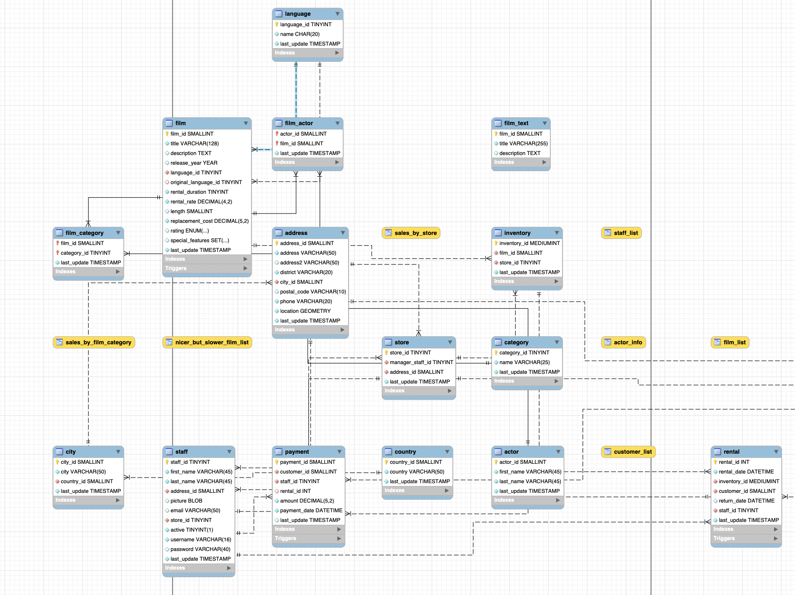

# GoArchive - MySQL Batch Archiver & Purger

[](https://golang.org/)
[](https://www.mysql.com/)
[](LICENSE)

GoArchive is a Go-based CLI tool designed for archiving MySQL relational data across servers. It features automatic dependency resolution, crash recovery, and replication lag monitoring.

## The Philosophy

Archiving is a custom-coded headache that developers end up building from scratch for every new project. Because every schema is different, "off-the-shelf" tools often fall short—they either ignore your foreign keys entirely or require a massive configuration just to avoid leaving behind a mess of orphaned records.

We got tired of reinventing the wheel and worrying about data integrity every time a table got too big. So we built GoArchive.

While legendary tools like pt-archiver are excellent for offloading single tables, they often fall short in complex ecosystems because they lack an inherent awareness of deep foreign key hierarchies. If you’ve ever looked at the MySQL Sakila sample database, you know that real-world relationships are rarely linear.



GoArchive was born from the need to visualize and automate these complexities. However, to maintain the integrity of your production environment, we adhere to two core principles:

1. **Cold Data Only**
GoArchive is designed to move COLD data to an archive server—specifically for performance tuning or meeting GDPR compliance.

 > [!IMPORTANT] 
 > If you intend to archive "hot" data that is currently receiving heavy transactions, stop here. Grab a coffee, enjoy the sunshine, and reconsider your architecture. Live-data shifting is outside the scope of this tool.

2. **Zero-Impact Production Archiving**
  In high-traffic production environments, database locks are the enemy. GoArchive is built to be "invisible":

  Replication Friendly: Integrated monitoring ensures the tool pauses automatically if replica lag exceeds your thresholds.

  Intelligent Batching: We recognize that a single record in a master table (e.g., an Order) can represent millions of rows in child tables (e.g., Logs or Transitions).

  Asymmetric Processing: By processing in configurable batches, GoArchive completes the move-and-purge cycle without ever holding a long-term lock on the master table.

> [!NOTE]
> For the Faint-of-heart: it has a feature to match and compare the row counts or even SHA256 checksum of the records between archive and source before deletion.

---

## 🛑 Limitations & Constraints

To maintain high safety standards and predictable behavior, GoArchive currently operates with the following constraints. Please review these before integrating the tool into your workflow.

### 1. Supported Relationship Types

GoArchive currently supports **1:1** and **1:N** (One-to-Many) relationships.

* **Unsupported:** Many-to-Many (N:M) relationships and complex self-referential "Adjacency List" hierarchies (e.g., a table that references its own ID to create an infinite tree) are not currently handled by the automatic resolver.

### 2. Foreign Key `CASCADE`

The tool is designed to manage the deletion order manually via Kahn's Algorithm to prevent circular looping. If your schema relies heavily on `ON DELETE CASCADE` at the database level, the tool may encounter conflicts or redundant operations. We recommend using GoArchive on schemas where you want the **application** to control the deletion flow.

### 3. Database Triggers

GoArchive does not have any account for logic hidden within **MySQL Triggers**.

* If a `DELETE` on your source table fires a trigger that modifies other tables, GoArchive will not be aware of those side effects.
* To prevent data inconsistency, we recommend auditing your triggers before running a purge.

### 4. MySQL Versioning

Currently, GoArchive is optimized for **MySQL 8.0+** using the **InnoDB** storage engine.

* Legacy engines like MyISAM are strictly not supported due to the lack of transactional integrity required for the Copy-Verify-Delete cycle.

---

> [!WARNING]
> **BETA STATUS**: This project is currently in a pre-production/beta state. While the core features are implemented, it has not yet undergone exhaustive large-scale testing. **DO NOT use this tool on production systems without extensive prior verification in your staging or test environments.**


## ⚠️ Important Disclaimer

This tool performs data deletion operations on your source database. 
- **Testing**: Always test your archive jobs on a staging system with a representative data set first.
- **Backups**: Ensure you have valid backups of your data before running archive or purge operations.
- **Verification**: Use the `dry-run` and `validate` commands to preview and verify your configuration before execution.

## Features

- **Automatic Dependency Resolution** - Uses Kahn's algorithm for topological sorting of related tables
- **Zero-Lock Processing** - Batch operations with configurable delays to minimize production impact
- **Crash Recovery** - Checkpoint-based resume capability with sub-minute recovery time
- **Data Integrity** - Optional count and SHA256 verification between source and destination
- **Replication Lag Monitoring** - Automatic pausing when replica lag exceeds thresholds
- **Dry-Run Mode** - Preview operations without making changes
- **Graceful Shutdown** - SIGTERM/SIGINT handling for clean interruption

## Quick Start

### Installation

```bash
# Clone the repository
git clone https://github.com/dbsmedya/goarchive.git
cd goarchive

# Build the binary
go build -o goarchive ./cmd/goarchive

# Move to your PATH (optional)
sudo mv goarchive /usr/local/bin/
```

### Configuration

Create a configuration file `archiver.yaml`:

```yaml
# Source database (production - data to archive)
source:
  host: ${SOURCE_DB_HOST:-localhost}
  port: 3306
  user: ${SOURCE_DB_USER:-archiver}
  password: ${SOURCE_DB_PASSWORD}
  database: ${SOURCE_DB_NAME:-production}
  max_connections: 10

# Destination database (archive storage)
destination:
  host: ${DEST_DB_HOST:-archive.db.internal}
  port: 3306
  user: ${DEST_DB_USER:-archiver}
  password: ${DEST_DB_PASSWORD}
  database: ${DEST_DB_NAME:-archive}
  max_connections: 10

# Archive jobs configuration
jobs:
  archive_old_orders:
    root_table: orders
    primary_key: id
    where: "created_at < DATE_SUB(NOW(), INTERVAL 2 YEAR)"
    relations:
      - table: order_items
        primary_key: id
        foreign_key: order_id
        dependency_type: "1-N"

      - table: order_payments
        primary_key: id
        foreign_key: order_id
        dependency_type: "1-N"

# Processing settings
processing:
  batch_size: 1000
  batch_delete_size: 500
  sleep_seconds: 1

# Safety settings
safety:
  lag_threshold: 10
  check_interval: 5
```

See [configs/archiver.yaml.example](configs/archiver.yaml.example) for a complete example.

### Basic Usage

```bash
# Check the plan from yaml:
goarchive plan -c archiver.yaml --job archive_old_orders


=================
  Relation Tree
=================

┌────────────────┐                                                 [ Tree Summary ]
│                │                                                 ----------------
│     orders     ├─────1-N──────┐                                  Root Table:     orders
│                │     │        │                                  Relations:      4 tables
└────────┬───────┘     └────────┼─────1-1───────────────┐          Max Depth:      2 levels
         │                      │                       │          Destination DB: ${DEST_DB_NAME}
         │                      │                       │
        1-N                     │                       │          [ Processing ]
         │                      │                       │          --------------
         ▼                      ▼                       ▼          Batch Size:      1000
┌────────────────┐     ┌────────────────┐         ┌───────────┐    Batch Delete:    500
│                │     │                │         │           │    Sleep:           1.0s
│  order_items   │     │ order_payments │         │ shipments │
│                │     │                │         │           │    [ Verification ]
└────────────────┘     └────────────────┘         └─────┬─────┘    ----------------
                                                        │          Method:          count
                                                        │
                                                        │
                                                       1-N
                                                        │
┌────────────────┐                                      │
│                │                                      │
│ shipment_items │◄─────────────────────────────────────┘
│                │
└────────────────┘


# Validate configuration and run preflight checks
goarchive validate -c archiver.yaml

# Preview what would be archived (dry-run)
goarchive dry-run -c archiver.yaml --job archive_old_orders

# Execute archive (copy to destination, then delete from source)
goarchive archive -c archiver.yaml --job archive_old_orders

# Purge only (delete without copying - USE WITH CAUTION!)
goarchive purge -c archiver.yaml --job archive_old_orders
```

## Commands

| Command | Description |
|---------|-------------|
| `archive` | Full archive workflow: discover → copy → verify → delete |
| `purge` | Delete-only mode for data cleanup without archiving |
| `dry-run` | Preview execution plan with row count estimates |
| `validate` | Run configuration validation and preflight checks |
| `plan` | Display table dependency graph and processing order |
| `list-jobs` | List all configured archive jobs |
| `version` | Show version information |

### Global Flags

```
  -c, --config string       Path to configuration file (default "archiver.yaml")
      --log-level string    Override log level (debug, info, warn, error)
      --log-format string   Override log format (json, text)
      --batch-size int      Override batch size for root IDs
      --batch-delete-size int  Override rows per DELETE statement
      --sleep float         Override seconds between batches
      --skip-verify         Skip data verification after copy
```

## Architecture

```
┌─────────────┐     ┌─────────────┐     ┌─────────────────────┐
│   CLI       │────▶│   Config    │────▶│   Database Manager  │
│  (Cobra)    │     │  (Viper)    │     │   (Connection Pool) │
└─────────────┘     └─────────────┘     └─────────────────────┘
                                                │
                         ┌──────────────────────┼──────────────────────┐
                         ▼                      ▼                      ▼
                   ┌──────────┐          ┌──────────┐          ┌──────────────┐
                   │  Source  │          │  Archive │          │   Replica    │
                   │  (MySQL) │          │  (MySQL) │          │   (MySQL)    │
                   └──────────┘          └──────────┘          └──────────────┘
                         │                      │
                         └──────────────────────┘
                                    │
                         ┌──────────┴──────────┐
                         ▼                     ▼
                ┌─────────────────┐    ┌──────────────┐
                │  Graph Builder  │    │  Lag Monitor │
                │ (Kahn's Algo)   │    │              │
                └─────────────────┘    └──────────────┘
                         │
         ┌───────────────┼───────────────┐
         ▼               ▼               ▼
   ┌──────────┐   ┌──────────┐   ┌──────────┐
   │  Copy    │   │ Verify   │   │  Delete  │
   │  Phase   │──▶│ (Count/  │──▶│  Phase   │
   │          │   │ SHA256)  │   │          │
   └──────────┘   └──────────┘   └──────────┘
```

### Processing Pipeline

1. **Preflight Checks** - Validate configuration, check triggers, verify InnoDB
2. **Graph Build** - Parse table relations → Kahn's algorithm → copy order (parent-first), delete order (child-first)
3. **Batch Loop** - Fetch root IDs → BFS discovery → copy transaction → verify → delete
4. **Safety** - Advisory locks prevent concurrent jobs; replication lag monitoring pauses processing

### Key Components

| Package | Purpose |
|---------|---------|
| `cmd/` | CLI command implementations (Cobra) |
| `internal/config/` | Configuration parsing with Viper |
| `internal/database/` | Database connection pooling and management |
| `internal/graph/` | Dependency graph builder with Kahn's algorithm |
| `internal/archiver/` | Core archive/purge/copy/delete logic |
| `internal/verifier/` | Count and SHA256 verification |
| `internal/lock/` | MySQL advisory lock implementation |
| `internal/logger/` | Structured logging with Zap |

## How It Works

### Dependency Resolution

GoArchive automatically determines the correct order for copying and deleting related records:

```
orders (root)
  ├── order_items (child)
  ├── order_payments (child)
  └── shipments (child)
        └── shipment_items (grandchild)

Copy Order:    orders → order_items → order_payments → shipments → shipment_items
Delete Order:  shipment_items → shipments → order_items → order_payments → orders
```

### Batch Processing

1. **Discovery** - BFS traversal finds all child records for a batch of root IDs
2. **Copy** - Transactional insert to destination in dependency order
3. **Verify** - Optional count/SHA256 verification ensures data integrity
4. **Delete** - Removes data from source in reverse dependency order
5. **Checkpoint** - Progress saved for crash recovery

### Crash Recovery

If interrupted, GoArchive can resume from the last checkpoint:

```sql
-- Check job status
SELECT * FROM archiver_job WHERE name = 'archive_old_orders';

-- Resume with same command
goarchive archive -c archiver.yaml --job archive_old_orders
```

## Requirements

- **Go**: 1.21 or later
- **MySQL**: 8.0+ with InnoDB storage engine
- **Network**: Access to source, destination, and optionally replica databases

## Database Permissions

The MySQL user requires these permissions:

```sql
-- On source database
GRANT SELECT, DELETE ON production.* TO 'archiver'@'%';
```

-- On archive database
GRANT INSERT, CREATE, SELECT ON archive.* TO 'archiver'@'%';

-- For advisory locks
GRANT EXECUTE ON FUNCTION sys.exec_stmt TO 'archiver'@'%';
Advisory Locks is to prevent two archiver instances from clashing on the same job.

## Testing

GoArchive includes comprehensive tests including unit tests and integration tests using the Sakila sample database.

### Quick Start

```bash
# Run all tests (unit + integration)
cd tests
./scripts/run-tests.sh --setup --sakila

# Run only unit tests
go test -short ./...
```

### Test Documentation

See [tests/README.md](tests/README.md) for detailed testing documentation including:
- Test environment setup with Docker
- Running unit and integration tests  
- Manual testing workflow
- Sakila E2E test cases
- Troubleshooting guide

## Configuration Reference

### Source/Destination Database

| Option | Description | Default |
|--------|-------------|---------|
| `host` | Database host | required |
| `port` | Database port | 3306 |
| `user` | Username | required |
| `password` | Password | required |
| `database` | Database name | required |
| `tls` | TLS mode (disable/preferred/required) | preferred |
| `max_connections` | Max open connections | 10 |
| `max_idle_connections` | Max idle connections | 5 |

### Job Configuration

| Option | Description | Required |
|--------|-------------|----------|
| `root_table` | Primary table to archive | yes |
| `primary_key` | Primary key column | yes (default: `id`) |
| `where` | WHERE clause for filtering rows | yes |
| `relations` | Related tables to include | no |

### Processing Settings

| Option | Description | Default |
|--------|-------------|---------|
| `batch_size` | Root IDs processed per batch | 1000 |
| `batch_delete_size` | Rows per DELETE statement | 500 |
| `sleep_seconds` | Pause between batches | 1 |

### Safety Settings

| Option | Description | Default |
|--------|-------------|---------|
| `lag_threshold` | Max replication lag in seconds | 10 |
| `check_interval` | Lag check frequency in seconds | 5 |
| `disable_foreign_key_checks` | Disable FK checks during copy | false |

## Project Status

- **Current Phase**: Phase 4 - Verification & Polish
- **Completion**: 131/139 tasks (94%)
- **Status**: Core functionality complete, testing and documentation in progress

## Contributing

1. Fork the repository
2. Create your feature branch (`git checkout -b feature/amazing-feature`)
3. Commit your changes (`git commit -m 'Add amazing feature'`)
4. Push to the branch (`git push origin feature/amazing-feature`)
5. Open a Pull Request

## License

This project is licensed under the MIT License - see the LICENSE file for details.

## Acknowledgments

- [Cobra](https://github.com/spf13/cobra) - CLI framework
- [Viper](https://github.com/spf13/viper) - Configuration management
- [Zap](https://github.com/uber-go/zap) - Structured logging
- [MySQL Driver](https://github.com/go-sql-driver/mysql) - Go MySQL driver
- [mermaid-ascii](https://github.com/AlexanderGrooff/mermaid-ascii) - ASCII diagram generation for table relationship visualization
