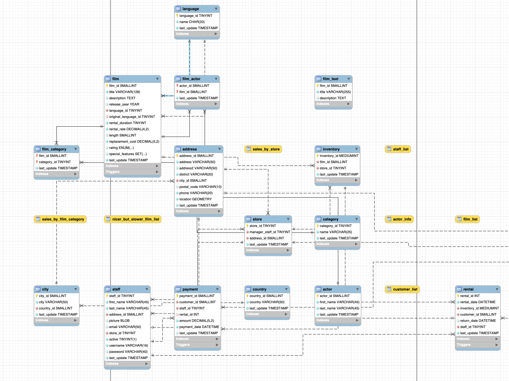

# GoArchive - MySQL Batch Archiver, Copier & Purger

[](https://golang.org/)
[](https://www.mysql.com/)
[](LICENSE)

GoArchive is a Go-based CLI tool designed for archiving MySQL relational data across servers. It features automatic dependency resolution, crash recovery, replication lag monitoring, and a `copy-only` mode that never deletes source data.

## The Philosophy

Archiving is a custom-coded headache that developers end up building from scratch for every new project. Because every schema is different, "off-the-shelf" tools often fall short—they either ignore your foreign keys entirely or require a massive configuration just to avoid leaving behind a mess of orphaned records.

We got tired of reinventing the wheel and worrying about data integrity every time a table got too big. So we built GoArchive.

While legendary tools like pt-archiver are excellent for offloading single tables, they often fall short in complex ecosystems because they lack an inherent awareness of deep foreign key hierarchies. If you’ve ever looked at the MySQL Sakila sample database, you know that real-world relationships are rarely linear.



GoArchive was born from the need to visualize and automate these complexities. However, to maintain the integrity of your production environment, we adhere to two core principles:

1. **Cold Data Only**
GoArchive is designed to move COLD data to an archive server—specifically for performance tuning or meeting GDPR compliance.

 > [!IMPORTANT] 
 > If you intend to archive "hot" data that is currently receiving heavy transactions, stop here. Grab a coffee, enjoy the sunshine, and reconsider your architecture. Live-data shifting is outside the scope of this tool.

2. **Zero-Impact Production Archiving**
  In high-traffic production environments, database locks are the enemy. GoArchive is built to be "invisible":

  Replication Friendly: Integrated monitoring ensures the tool pauses automatically if replica lag exceeds your thresholds.

  Intelligent Batching: We recognize that a single record in a master table (e.g., an Order) can represent millions of rows in child tables (e.g., Logs or Transitions).

  Asymmetric Processing: By processing in configurable batches, GoArchive completes the move-and-purge cycle without ever holding a long-term lock on the master table.

> [!NOTE]
> For the Faint-of-heart: it has a feature to match and compare the row counts or even SHA256 checksum of the records between archive and source before deletion.

---

## 🛑 Limitations & Constraints

To maintain high safety standards and predictable behavior, GoArchive currently operates with the following constraints. Please review these before integrating the tool into your workflow.

### 1. Supported Relationship Types

GoArchive currently supports **1:1** and **1:N** (One-to-Many) relationships.

* **Unsupported:** Many-to-Many (N:M) relationships and complex self-referential "Adjacency List" hierarchies (e.g., a table that references its own ID to create an infinite tree) are not currently handled by the automatic resolver.

### 2. Foreign Key `CASCADE`

The tool is designed to manage the deletion order manually via Kahn's Algorithm to prevent circular looping. If your schema relies heavily on `ON DELETE CASCADE` at the database level, the tool may encounter conflicts or redundant operations. We recommend using GoArchive on schemas where you want the **application** to control the deletion flow.

### 3. Database Triggers

GoArchive does not have any account for logic hidden within **MySQL Triggers**.

* If a `DELETE` on your source table fires a trigger that modifies other tables, GoArchive will not be aware of those side effects.
* To prevent data inconsistency, we recommend auditing your triggers before running a purge.

### 4. MySQL Versioning

Currently, GoArchive is optimized for **MySQL 8.0+** using the **InnoDB** storage engine.

* Legacy engines like MyISAM are strictly not supported due to the lack of transactional integrity required for the Copy-Verify-Delete cycle.

### 5. Trust Model for SQL Configuration

GoArchive intentionally treats configuration files as **operator-controlled and trusted** input.

* Job `where` values are raw SQL fragments injected into archive selection queries.
* Connections intentionally use `multiStatements=true` for operational compatibility.
* Do not expose config editing to untrusted users or untrusted automation pipelines.

---

> [!WARNING]
> **BETA STATUS**: This project is currently in a pre-production/beta state. While the core features are implemented, it has not yet undergone exhaustive large-scale testing. **DO NOT use this tool on production systems without extensive prior verification in your staging or test environments.**


## ⚠️ Important Disclaimer

This tool can perform data deletion operations on your source database (`archive`, `purge`). 
- **Testing**: Always test your archive jobs on a staging system with a representative data set first.
- **Backups**: Ensure you have valid backups of your data before running archive or purge operations.
- **Verification**: Use the `dry-run` and `validate` commands to preview and verify your configuration before execution.

## Features

- **Automatic Dependency Resolution** - Uses Kahn's algorithm for topological sorting of related tables
- **Zero-Lock Processing** - Batch operations with configurable delays to minimize production impact
- **Crash Recovery** - Checkpoint-based resume capability with sub-minute recovery time
- **Data Integrity** - Optional count and SHA256 verification between source and destination
- **Replication Lag Monitoring** - Automatic pausing when replica lag exceeds thresholds
- **Dry-Run Mode** - Preview operations without making changes
- **Graceful Shutdown** - SIGTERM/SIGINT handling for clean interruption

## Quick Start

### Installation

```bash
# Clone the repository
git clone https://github.com/dbsmedya/goarchive.git
cd goarchive

# Build the binary
go build -o goarchive ./cmd/goarchive

# Move to your PATH (optional)
sudo mv goarchive /usr/local/bin/
```

### Configuration

Create a configuration file `archiver.yaml`:

```yaml
# Source database (production - data to archive)
source:
  host: localhost
  port: 3306
  user: archiver
  password: change_me
  database: production
  max_connections: 10

# Destination database (archive storage)
destination:
  host: archive.db.internal
  port: 3306
  user: archiver
  password: change_me
  database: archive
  max_connections: 10

# Archive jobs configuration
jobs:
  archive_old_orders:
    root_table: orders
    primary_key: id
    where: "created_at < DATE_SUB(NOW(), INTERVAL 2 YEAR)"
    relations:
      - table: order_items
        primary_key: id
        foreign_key: order_id
        dependency_type: "1-N"

      - table: order_payments
        primary_key: id
        foreign_key: order_id
        dependency_type: "1-N"

# Processing settings
processing:
  batch_size: 1000
  batch_delete_size: 500
  sleep_seconds: 1

# Safety settings
safety:
  lag_threshold: 10
  check_interval: 5
```

See [configs/archiver.yaml.example](configs/archiver.yaml.example) for a complete example.

### Basic Usage

```bash
# Check the plan from yaml:
goarchive plan -c archiver.yaml --job archive_old_orders


=================
  Relation Tree
=================

┌────────────────┐                                                 [ Tree Summary ]
│                │                                                 ----------------
│     orders     ├─────1-N──────┐                                  Root Table:     orders
│                │     │        │                                  Relations:      4 tables
└────────┬───────┘     └────────┼─────1-1───────────────┐          Max Depth:      2 levels
         │                      │                       │          Destination DB: archive
         │                      │                       │
        1-N                     │                       │          [ Processing ]
         │                      │                       │          --------------
         ▼                      ▼                       ▼          Batch Size:      1000
┌────────────────┐     ┌────────────────┐         ┌───────────┐    Batch Delete:    500
│                │     │                │         │           │    Sleep:           1.0s
│  order_items   │     │ order_payments │         │ shipments │
│                │     │                │         │           │    [ Verification ]
└────────────────┘     └────────────────┘         └─────┬─────┘    ----------------
                                                        │          Method:          count
                                                        │
                                                        │
                                                       1-N
                                                        │
┌────────────────┐                                      │
│                │                                      │
│ shipment_items │◄─────────────────────────────────────┘
│                │
└────────────────┘


# Validate configuration and run preflight checks
goarchive validate -c archiver.yaml

# Preview what would be archived (dry-run)
goarchive dry-run -c archiver.yaml --job archive_old_orders

# Execute archive (copy to destination, then delete from source)
goarchive archive -c archiver.yaml --job archive_old_orders

# Copy-only (copy to destination, never delete from source)
goarchive copy-only -c archiver.yaml --job archive_old_orders

# Copy-only force mode (shows confirmation prompt before bypassing duplicate preflight)
goarchive copy-only -c archiver.yaml --job archive_old_orders --force

# Purge only (delete without copying - USE WITH CAUTION!)
goarchive purge -c archiver.yaml --job archive_old_orders
```

## Commands

| Command | Description |
|---------|-------------|
| `archive` | Full archive workflow: discover → copy → verify → delete |
| `copy-only` | Copy + verify workflow without source deletion (prompts only with `--force`) |
| `purge` | Delete-only mode for data cleanup without archiving |
| `dry-run` | Preview execution plan with row count estimates |
| `validate` | Run configuration validation and preflight checks |
| `plan` | Display table dependency graph and processing order |
| `list-jobs` | List all configured archive jobs |
| `version` | Show version information |

### Global Flags

```
  -c, --config string       Path to configuration file (default "archiver.yaml")
      --log-level string    Override log level (debug, info, warn, error)
      --log-format string   Override log format (json, text)
      --batch-size int      Override batch size for root IDs
      --batch-delete-size int  Override rows per DELETE statement
      --sleep float         Override seconds between batches
      --skip-verify         Skip data verification after copy
```

> [!NOTE]
> `--batch-delete-size` is not supported by `copy-only` and will return an error if provided.

## Architecture

```
┌─────────────┐     ┌─────────────┐     ┌─────────────────────┐
│   CLI       │────▶│   Config    │────▶│   Database Manager  │
│  (Cobra)    │     │  (Viper)    │     │   (Connection Pool) │
└─────────────┘     └─────────────┘     └─────────────────────┘
                                                │
                         ┌──────────────────────┼──────────────────────┐
                         ▼                      ▼                      ▼
                   ┌──────────┐          ┌──────────┐          ┌──────────────┐
                   │  Source  │          │  Archive │          │   Replica    │
                   │  (MySQL) │          │  (MySQL) │          │   (MySQL)    │
                   └──────────┘          └──────────┘          └──────────────┘
                         │                      │
                         └──────────────────────┘
                                    │
                         ┌──────────┴──────────┐
                         ▼                     ▼
                ┌─────────────────┐    ┌──────────────┐
                │  Graph Builder  │    │  Lag Monitor │
                │ (Kahn's Algo)   │    │              │
                └─────────────────┘    └──────────────┘
                         │
         ┌───────────────┼───────────────┐
         ▼               ▼               ▼
   ┌──────────┐   ┌──────────┐   ┌──────────┐
   │  Copy    │   │ Verify   │   │  Delete  │
   │  Phase   │──▶│ (Count/  │──▶│  Phase   │
   │          │   │ SHA256)  │   │          │
   └──────────┘   └──────────┘   └──────────┘
```

### Processing Pipeline

1. **Preflight Checks** - Validate configuration, check triggers, verify InnoDB
2. **Graph Build** - Parse table relations → Kahn's algorithm → copy order (parent-first), delete order (child-first)
3. **Batch Loop** - Fetch root IDs → BFS discovery → copy transaction → verify → delete
4. **Safety** - Advisory locks + destination job-state checks prevent concurrent archive/purge/copy-only overlap on the same root table; replication lag monitoring pauses processing

### Key Components

| Package | Purpose |
|---------|---------|
| `cmd/` | CLI command implementations (Cobra) |
| `internal/config/` | Configuration parsing with Viper |
| `internal/database/` | Database connection pooling and management |
| `internal/graph/` | Dependency graph builder with Kahn's algorithm |
| `internal/archiver/` | Core archive/purge/copy/delete logic |
| `internal/verifier/` | Count and SHA256 verification |
| `internal/lock/` | MySQL advisory lock implementation |
| `internal/logger/` | Structured logging with Zap |

## How It Works

### Dependency Resolution

GoArchive automatically determines the correct order for copying and deleting related records:

```
orders (root)
  ├── order_items (child)
  ├── order_payments (child)
  └── shipments (child)
        └── shipment_items (grandchild)

Copy Order:    orders → order_items → order_payments → shipments → shipment_items
Delete Order:  shipment_items → shipments → order_items → order_payments → orders
```

### Batch Processing

1. **Discovery** - BFS traversal finds all child records for a batch of root IDs
2. **Copy** - Transactional insert to destination in dependency order
3. **Verify** - Optional count/SHA256 verification ensures data integrity
4. **Delete** - Removes data from source in reverse dependency order
5. **Checkpoint** - Progress saved for crash recovery

### Crash Recovery

If interrupted, GoArchive can resume from the last checkpoint:

```sql
-- Check job status
SELECT * FROM archiver_job WHERE name = 'archive_old_orders';

-- Resume with same command
goarchive archive -c archiver.yaml --job archive_old_orders
```

## Requirements

- **Go**: 1.21 or later
- **MySQL**: 8.0+ with InnoDB storage engine
- **Network**: Access to source, destination, and optionally replica databases

## Database Permissions

The MySQL user requires these permissions:

```sql
-- On source database
GRANT SELECT, DELETE ON production.* TO 'archiver'@'%';
```

-- On archive database
GRANT INSERT, CREATE, SELECT ON archive.* TO 'archiver'@'%';

-- For advisory locks
GRANT EXECUTE ON FUNCTION sys.exec_stmt TO 'archiver'@'%';
Advisory Locks is to prevent two archiver instances from clashing on the same job.

## Testing

GoArchive includes comprehensive tests including unit tests and integration tests.

### Quick Start

```bash
# Run only unit tests (fast, no database required)
go test -short ./...

# Run all tests (requires database setup)
make test-integration
```

### Integration Tests

Integration tests require two MySQL databases (source and destination). You can use Docker for local testing or point to existing test databases.

#### Prerequisites

**Option 1: Using Docker (Recommended for local development)**

```bash
# Start test databases
make test-up

# Verify databases are running
make test-status
```

**Option 2: Using existing databases**

Configure the integration test to use your existing MySQL instances (see Configuration below).

#### Configuration

Integration tests require database credentials. You have three options:

**Option A: Environment Variable (Quickest)**
```bash
export MYSQL_ROOT_PASSWORD=your_password
INTEGRATION_FORCE=true go test -v -run 'TestOrchestrator_.*_Integration' ./internal/archiver/...
```

**Option B: Using Makefile**
```bash
export MYSQL_ROOT_PASSWORD=your_password
make test-integration
```

**Option C: Custom Config File**
```bash
# Create your own config file
cp internal/archiver/integration_test.yaml /path/to/my-config.yaml
# Edit with your credentials
export INTEGRATION_CONFIG=/path/to/my-config.yaml
INTEGRATION_FORCE=true go test -v -run 'TestOrchestrator_.*_Integration' ./internal/archiver/...
```

#### Configuration File Format

Create `internal/archiver/integration_test.yaml`:

```yaml
databases:
  - name: source
    host: 127.0.0.1
    port: 3305
    user: root
    password: your_password_here  # Required!
    database: goarchive_test

  - name: destination
    host: 127.0.0.1
    port: 3307
    user: root
    password: your_password_here  # Required!
    database: goarchive_test

force: false  # Set to true to drop/recreate databases
fixture_path: testdata/customer_orders.sql
```

#### Running Tests

```bash
# Run all integration tests
make test-integration

# Run specific integration test
MYSQL_ROOT_PASSWORD=your_password go test -v \
  -run TestOrchestrator_FullArchiveCycle_Integration \
  ./internal/archiver/...

# Force database recreation (clean slate)
INTEGRATION_FORCE=true MYSQL_ROOT_PASSWORD=your_password \
  go test -v -run 'TestOrchestrator_.*_Integration' ./internal/archiver/...

# Stop test databases when done
make test-down
```

#### Available Integration Tests

| Test | Description |
|------|-------------|
| `TestOrchestrator_FullArchiveCycle_Integration` | End-to-end archive workflow |
| `TestOrchestrator_CrashRecovery_Integration` | Resume after simulated crash |
| `TestOrchestrator_ReplicationLagPause_Integration` | Lag monitoring behavior |
| `TestOrchestrator_VerificationMismatch_Integration` | Data verification logic |
| `TestOrchestrator_ContextCancellation_Integration` | Graceful shutdown handling |
| `TestOrchestrator_EmptyResultSet_Integration` | Empty result handling |
| `TestOrchestrator_MultiLevelHierarchy_Integration` | 3-level deep relationships |

### E2E Tests with Sakila

For comprehensive end-to-end testing with the Sakila sample database:

```bash
cd tests
./scripts/run-tests.sh --setup --sakila
```

### Test Documentation

See [tests/README.md](tests/README.md) for detailed testing documentation including:
- Sakila E2E test cases
- Manual testing workflow
- Troubleshooting guide

## Configuration Reference

### Source/Destination Database

| Option | Description | Default |
|--------|-------------|---------|
| `host` | Database host | required |
| `port` | Database port | 3306 |
| `user` | Username | required |
| `password` | Password | required |
| `database` | Database name | required |
| `tls` | TLS mode (disable/preferred/required) | preferred |
| `max_connections` | Max open connections | 10 |
| `max_idle_connections` | Max idle connections | 5 |

### Job Configuration

| Option | Description | Required |
|--------|-------------|----------|
| `root_table` | Primary table to archive | yes |
| `primary_key` | Primary key column | yes (default: `id`) |
| `where` | Raw SQL WHERE clause for filtering rows (trusted operator input) | yes |
| `relations` | Related tables to include | no |

### Processing Settings

| Option | Description | Default |
|--------|-------------|---------|
| `batch_size` | Root IDs processed per batch | 1000 |
| `batch_delete_size` | Rows per DELETE statement | 500 |
| `sleep_seconds` | Pause between batches | 1 |

### Safety Settings

| Option | Description | Default |
|--------|-------------|---------|
| `lag_threshold` | Max replication lag in seconds | 10 |
| `check_interval` | Lag check frequency in seconds | 5 |
| `disable_foreign_key_checks` | Disable FK checks during copy | false |

## Upgrade Notes

### Resume metadata and advisory locks unified on destination

Previously `purge` wrote its `archiver_job` and `archiver_job_log` state tables
to the **source** database, while `archive` and `copy-only` wrote them to the
**destination** database. Advisory locks were similarly split (archive and
purge on source, copy-only on destination). This left gaps in the
cross-command concurrency check and made state hard to reason about.

After this upgrade:

- `archive`, `purge`, and `copy-only` all use the **destination** database for
  both `archiver_job`/`archiver_job_log` metadata and for advisory locks.
- `purge` now requires a destination connection to be configured (it was
  already implicitly required by validation, but is now load-bearing at
  runtime).

**DBA action required:** drop the now-unused state tables from the source
database after upgrading. Any checkpoint rows there are orphaned and will not
be migrated automatically:

```sql
-- On the SOURCE server only
DROP TABLE IF EXISTS archiver_job_log;
DROP TABLE IF EXISTS archiver_job;
```

No action is needed on the destination — archive and copy-only already wrote
there, and purge's existing job rows remain on source (harmless once dropped).

### FOREIGN_KEY_CHECKS handling hardened

`safety.disable_foreign_key_checks` now runs on a dedicated destination
connection and is explicitly reset before the connection returns to the pool.
Previously, enabling it could leak `FOREIGN_KEY_CHECKS=0` into other pooled
destination operations.

The option remains **disabled by default**. If you enable it, `goarchive
validate` and every copy run will emit a loud warning — use only when you have
verified the copy order and accept the risk of inserting rows that bypass FK
constraints.

## Project Status

- **Edition**: Community
- **Version**: `0.9.0-community` (beta)
- **Recommended for**: single-operator workstation archival of cold MySQL data
- **Test coverage**: 835 unit tests, 24 integration tests against real MySQL, 3 working Sakila E2E tests, 5 preflight-validation demonstration tests

### Known Limits & Caution ⚠️

The community edition is suitable for the scope described above. Operators
should be aware of the following known limits before pointing it at real data:

- **Deep or wide graphs can exhaust memory.** BFS discovery accumulates all
  descendant primary keys per root batch in memory. Deeply nested schemas
  (parent → child → grandchild → great-grandchild, each 1-N with high fanout)
  can grow the accumulator unbounded. If your root table has ~1M matching rows
  and each has many descendants per level, start with a small `batch_size`
  (e.g. 100) and scale up only after observing memory.
- **Copy-phase transaction spans all tables.** One destination transaction
  covers the entire copy phase, which holds row locks on already-inserted
  tables while later tables are still streaming. Avoid running this against a
  shared destination that other workloads are reading.
- **No built-in metrics or telemetry.** Operators monitor progress through
  the structured log output and by querying `archiver_job_log` directly.
- **Sequential by design.** One root PK at a time, one job at a time per
  destination. The advisory lock prevents concurrent runs of the same job name.
- **Validate before every run.** `goarchive validate` runs the full preflight
  chain and should PASS before you trust an `archive` run. For schemas with
  DELETE triggers (e.g. Sakila's `del_film`), pass `--force-triggers` after
  you've reviewed what those triggers do.
- **Schema-stable assumption.** GoArchive assumes source and destination
  schemas do not change during a batch loop. Run schema migrations either
  before or after archive jobs, never concurrently.
- **Data loss on misconfiguration is possible.** A misconfigured job that
  passes validate but has the wrong `WHERE` clause can delete the wrong rows
  from source. Always run `goarchive dry-run` and review the estimated row
  counts before executing `archive`.

### What's Included in Community

Complete end-to-end archive, purge, and copy-only workflows:
- Dependency graph + topological copy / reverse-topological delete order
- Preflight checks: storage engine, FK indexes, FK coverage (external + internal),
  destination schema compatibility, destination write permissions, DELETE
  triggers, INSERT triggers on destination, CASCADE warnings
- Crash recovery via `archiver_job` + `archiver_job_log` on destination
- Advisory locks serialize job-name execution across all three commands
- Replication lag monitor (pauses batches when replica lag exceeds threshold)
- Verification by row count or SHA256
- Dry-run mode with execution plan output

### Planned for Enterprise (Not in Community)

- Observability: Prometheus metrics, OpenTelemetry traces, dashboards
- Parallelism: multi-root-PK concurrent processing, pipelining copy/verify/delete
- Large-scale load testing and tuning for 100M+ row datasets
- Admin API for runtime pause / resume / inspect
- Multi-tenancy and horizontal scale
- Adaptive rate limiting

## Contributing

1. Fork the repository
2. Create your feature branch (`git checkout -b feature/amazing-feature`)
3. Commit your changes (`git commit -m 'Add amazing feature'`)
4. Push to the branch (`git push origin feature/amazing-feature`)
5. Open a Pull Request

## License

This project is licensed under the MIT License - see the LICENSE file for details.

## Acknowledgments

- [Cobra](https://github.com/spf13/cobra) - CLI framework
- [Viper](https://github.com/spf13/viper) - Configuration management
- [Zap](https://github.com/uber-go/zap) - Structured logging
- [MySQL Driver](https://github.com/go-sql-driver/mysql) - Go MySQL driver
- [mermaid-ascii](https://github.com/AlexanderGrooff/mermaid-ascii) - ASCII diagram generation for table relationship visualization
