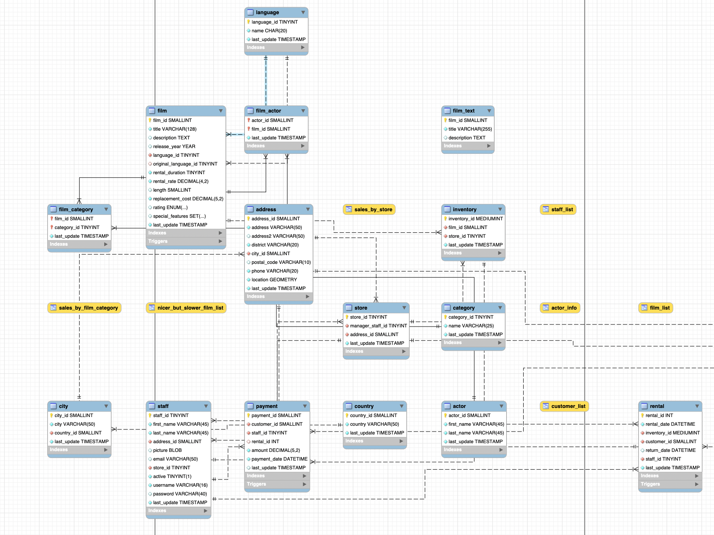

# GoArchive — Foreign-Key-Aware MySQL Archiver for Related Tables

[](https://golang.org/)
[](https://www.mysql.com/)
[](LICENSE)

**Archive, copy, or purge a parent row together with every child row that depends on it — in dependency order, verified before anything is deleted.**

GoArchive is a Go CLI tool for archiving MySQL relational data across servers. Unlike single-table archivers, it resolves foreign-key dependencies automatically using Kahn's topological sort, so deleting old `orders` never leaves orphaned `order_items` behind. Each batch is verified by row count or SHA256 **before** source rows are deleted, and an interrupted run resumes from a persistent checkpoint.

## What problem does this solve?

You need to delete or archive old data from a production MySQL database, but those rows have children:

- Deleting old `orders` orphans `order_items`, `order_payments`, and `shipments`
- Deleting old `customers` breaks foreign keys three levels deep
- `ON DELETE CASCADE` silently removes rows you never archived
- Single-table archivers move the parent and leave the children behind
- Deleting in the wrong order fails with MySQL Error 1451 (`Cannot delete or update a parent row`)

GoArchive takes a declared parent-child relation tree, discovers every dependent row by BFS traversal, copies the whole subgraph to an archive server **parent-first**, verifies it arrived intact, then deletes from the source **child-first**.

**Typical uses:** MySQL data retention and GDPR right-to-erasure · shrinking oversized tables to restore query performance · moving cold data to an archive server · purging staging data while preserving referential integrity.

## GoArchive vs pt-archiver

[pt-archiver](https://docs.percona.com/percona-toolkit/pt-archiver.html) is the mature, widely-adopted standard for MySQL archiving, and it remains the better choice for most work. Use pt-archiver when you are archiving a **single table**, or need file/CSV output, `LOAD DATA INFILE` bulk loading, composite primary keys, MyISAM, MySQL 5.x, progress reporting, or multi-replica lag checks.

GoArchive exists for the one case pt-archiver cannot express without writing a Perl plugin: **archiving a parent row together with its child subgraph**. It adds verification before deletion and persistent crash recovery.

| | pt-archiver | GoArchive |
|---|---|---|
| Tables per run | one | root + full child subgraph |
| Dependency ordering | manual, via plugin | automatic (Kahn's algorithm) |
| Verify copy before delete | ❌ | ✅ count or SHA256 |
| Crash recovery / resume | ❌ | ✅ per-row checkpoint |
| Foreign key coverage check | ❌ | ✅ blocks uncovered FKs |
| Composite / non-integer PKs | ✅ | ❌ |
| File / CSV output | ✅ | ❌ |
| MyISAM, MySQL 5.x | ✅ | ❌ |
| Progress & statistics output | ✅ | ❌ |
| Maturity | ~19 years | ~6 months |

Many teams use both: pt-archiver for high-volume single-table nibbling, GoArchive for relational subgraphs where ordering and verification matter more than raw throughput.

## Is GoArchive right for your schema?

**Requires:**

- MySQL 8.0+ with the InnoDB storage engine
- A **single-column `PRIMARY KEY`** on every participating table
- An **integer primary key on the root table** (child tables may use any single-column type)
- 1:1 or 1:N relationships

**Not supported:** composite (multi-column) primary keys · UUID, VARCHAR, or datetime root keys · many-to-many (N:M) join tables as first-class citizens · self-referential tree hierarchies · MyISAM · MySQL 5.x.

Preflight rejects an unsupported schema before any data moves — see [Limitations](docs/README_LIMITATIONS.md) for the full list and [Validation](docs/README_VALIDATION.md) for what each check does.

## The Philosophy

Archiving is a custom-coded headache that developers end up building from scratch for every new project. Because every schema is different, "off-the-shelf" tools often fall short—they either ignore your foreign keys entirely or require a massive configuration just to avoid leaving behind a mess of orphaned records.

We got tired of reinventing the wheel and worrying about data integrity every time a table got too big. So we built GoArchive.

While legendary tools like pt-archiver are excellent for offloading single tables, they often fall short in complex ecosystems because they lack an inherent awareness of deep foreign key hierarchies. If you’ve ever looked at the MySQL Sakila sample database, you know that real-world relationships are rarely linear.



GoArchive was born from the need to visualize and automate these complexities. However, to maintain the integrity of your production environment, we adhere to two core principles:

1. **Cold Data Only**
GoArchive is designed ONLY to move COLD data to an archive server—specifically for performance tuning or meeting GDPR compliance.

 > [!IMPORTANT] 
 > If you intend to archive "hot" data that is currently receiving heavy transactions, stop here. Grab a coffee, enjoy the sunshine, and reconsider your architecture. Live-data shifting is outside the scope of this tool.

2. **Zero-Impact Production Archiving**
  In high-traffic production environments, database locks are the enemy. GoArchive is built to be "invisible":

  Replication Friendly: Integrated monitoring ensures the tool pauses automatically if replica lag exceeds your thresholds.

  Intelligent Batching: We recognize that a single record in a master table (e.g., an Order) can represent millions of rows in child tables (e.g., Logs or Transitions).

  Asymmetric Processing: By processing in configurable batches, GoArchive completes the move-and-purge cycle without ever holding a long-term lock on the master table.

> [!NOTE]
> For the Faint-of-heart: it has a feature to match and compare the row counts or even SHA256 checksum of the records between archive and source before deletion.

---

## ⚠️ Important Disclaimer

> [!WARNING]
> This tool performs data deletion on your source database (`archive`, `purge`). It is in use in limited production environments, but has not yet undergone exhaustive large-scale testing. **Rigorously test every archive job in a staging or test environment with representative data before running it against production.**

- **Testing**: Always test your archive jobs on a staging system with a representative data set first.
- **Backups**: Ensure you have valid backups of your data before running archive or purge operations.
- **Verification**: Use the `dry-run` and `validate` commands to preview and verify your configuration before execution.

GoArchive also operates under deliberate constraints — single-column primary keys, integer root keys, InnoDB only, 1:1 and 1:N relationships. Several are enforced by preflight and will stop a run before it starts. **Read [Limitations & Constraints](docs/README_LIMITATIONS.md) before integrating the tool into your workflow.**

## Documentation

| Document | Covers |
|----------|--------|
| [Configuration](docs/README_CONFIGURATION.md) | Every config block, option, default, and precedence rule |
| [Validation & Preflight](docs/README_VALIDATION.md) | All 19 preflight checks, what fails and how to fix it |
| [Permissions](docs/README_PERMISSIONS.md) | Privilege matrix, grant recipes, what preflight actually enforces |
| [Limitations](docs/README_LIMITATIONS.md) | Hard constraints, model limitations, operational cautions |
| [Operations](docs/README_OPERATIONS.md) | Commands and flags, tuning, pausing, crash recovery |
| [Job Tracking Schema](docs/README_JOBS_SCHEMA.md) | DBA guide: tracking table structures, inspection queries, safe cleanup |
| [Testing](docs/README_TESTING.md) | Test layers and how to run them |
| [INSTALL.md](INSTALL.md) | Installation and build reference |

## Features

- **Automatic foreign key dependency resolution** - Kahn's algorithm topologically sorts related tables into a parent-first copy order and a child-first delete order, so no operation ever orphans a row
- **Referential integrity checks** - Detects foreign keys from outside the archive set pointing into it, including across schemas, and refuses to run rather than let an external `ON DELETE CASCADE` delete uncopied rows
- **Verification before deletion** - Optional row count or SHA256 comparison between source and destination; a mismatch aborts before anything is deleted
- **Crash recovery and resume** - Per-row checkpoint state persisted in MySQL; an interrupted archive resumes where it stopped instead of restarting
- **Zero-lock batch processing** - Configurable batch sizes and delays keep long-term locks off production tables
- **Replication lag monitoring** - Pauses automatically when replica lag exceeds a threshold
- **Trigger and schema safety** - Detects DELETE triggers, destination INSERT triggers, incompatible destination schemas, and composite primary keys before any data moves
- **Dry-run mode** - Preview the execution plan and filtered row counts without making changes
- **Copy-only mode** - Replicate a relational subgraph to another server without ever deleting from source
- **Graceful shutdown** - SIGTERM/SIGINT handling stops cleanly at a batch boundary

## Quick Start

### Installation

```bash
# Clone the repository
git clone https://github.com/dbsmedya/goarchive.git
cd goarchive

# Build the binary
go build -o goarchive ./cmd/goarchive

# Move to your PATH (optional)
sudo mv goarchive /usr/local/bin/
```

See [INSTALL.md](INSTALL.md) for Make targets, release builds, and platform notes.

### Configuration

Create a configuration file `archiver.yaml`:

```yaml
# Source database (production - data to archive)
source:
  host: localhost
  port: 3306
  user: archiver
  password: change_me
  database: production
  max_connections: 10

# Destination database (archive storage)
destination:
  host: archive.db.internal
  port: 3306
  user: archiver
  password: change_me
  database: archive
  max_connections: 10

# Archive jobs configuration
jobs:
  archive_old_orders:
    root_table: orders
    primary_key: id
    where: "created_at < DATE_SUB(NOW(), INTERVAL 2 YEAR)"
    relations:
      - table: order_items
        primary_key: id
        foreign_key: order_id
        dependency_type: "1-N"

      - table: order_payments
        primary_key: id
        foreign_key: order_id
        dependency_type: "1-N"

# Processing settings
processing:
  batch_size: 1000
  batch_delete_size: 500
  sleep_seconds: 1

# Safety settings
safety:
  lag_threshold: 10
  check_interval: 5
```

`where` is required on every job — use `where: "1=1"` to deliberately process a whole table. See [configs/archiver.yaml.example](configs/archiver.yaml.example) for a complete annotated example.

📖 **Every block, option, default, and per-job override rule is documented in [Configuration](docs/README_CONFIGURATION.md).** Note that processing settings are config-file only — there are no `--batch-size` style CLI flags.

### Basic Usage

```bash
# Check the plan from yaml:
goarchive plan -c archiver.yaml --job archive_old_orders


=================
  Relation Tree
=================

┌────────────────┐                                                 [ Tree Summary ]
│                │                                                 ----------------
│     orders     ├─────1-N──────┐                                  Root Table:     orders
│                │     │        │                                  Relations:      4 tables
└────────┬───────┘     └────────┼─────1-1───────────────┐          Max Depth:      2 levels
         │                      │                       │          Destination DB: archive
         │                      │                       │
        1-N                     │                       │          [ Processing ]
         │                      │                       │          --------------
         ▼                      ▼                       ▼          Batch Size:      1000
┌────────────────┐     ┌────────────────┐         ┌───────────┐    Batch Delete:    500
│                │     │                │         │           │    Sleep:           1.0s
│  order_items   │     │ order_payments │         │ shipments │
│                │     │                │         │           │    [ Verification ]
└────────────────┘     └────────────────┘         └─────┬─────┘    ----------------
                                                        │          Method:          count
                                                        │
                                                        │
                                                       1-N
                                                        │
┌────────────────┐                                      │
│                │                                      │
│ shipment_items │◄─────────────────────────────────────┘
│                │
└────────────────┘


# Validate configuration and run preflight checks
goarchive validate -c archiver.yaml

# Preview what would be archived (dry-run)
goarchive dry-run -c archiver.yaml --job archive_old_orders

# Execute archive (runs preflight, copies to destination, verifies, then deletes)
goarchive archive -c archiver.yaml --job archive_old_orders

# Copy-only (runs non-destructive preflight, copies to destination, never deletes source)
goarchive copy-only -c archiver.yaml --job archive_old_orders

# Copy-only force mode (shows confirmation prompt before bypassing duplicate preflight)
goarchive copy-only -c archiver.yaml --job archive_old_orders --force

# Purge only (runs source-side preflight, then deletes without copying - USE WITH CAUTION!)
goarchive purge -c archiver.yaml --job archive_old_orders
```

**Recommended workflow:** `validate` → `dry-run` → `archive`. The dry-run step shows the WHERE clause, the row counts the run would actually touch, and validates `batch_size` against the destination's limits before you commit to a real run.

📖 **[Operations](docs/README_OPERATIONS.md)** documents every command, the per-command flags, throughput tuning, the `sentinel_file` pause switch, and crash recovery. **[Validation & Preflight](docs/README_VALIDATION.md)** documents what `validate` actually checks and how to resolve each failure.

## Architecture

```
┌─────────────┐     ┌─────────────┐     ┌─────────────────────┐
│   CLI       │────▶│   Config    │────▶│   Database Manager  │
│  (Cobra)    │     │  (Viper)    │     │   (Connection Pool) │
└─────────────┘     └─────────────┘     └─────────────────────┘
                                                │
                         ┌──────────────────────┼──────────────────────┐
                         ▼                      ▼                      ▼
                   ┌──────────┐          ┌──────────┐          ┌──────────────┐
                   │  Source  │          │  Archive │          │   Replica    │
                   │  (MySQL) │          │  (MySQL) │          │   (MySQL)    │
                   └──────────┘          └──────────┘          └──────────────┘
                         │                      │
                         └──────────────────────┘
                                    │
                         ┌──────────┴──────────┐
                         ▼                     ▼
                ┌─────────────────┐    ┌──────────────┐
                │  Graph Builder  │    │  Lag Monitor │
                │ (Kahn's Algo)   │    │              │
                └─────────────────┘    └──────────────┘
                         │
         ┌───────────────┼───────────────┐
         ▼               ▼               ▼
   ┌──────────┐   ┌──────────┐   ┌──────────┐
   │  Copy    │   │ Verify   │   │  Delete  │
   │  Phase   │──▶│ (Count/  │──▶│  Phase   │
   │          │   │ SHA256)  │   │          │
   └──────────┘   └──────────┘   └──────────┘
```

### Processing Pipeline

1. **Preflight Checks** - Validate configuration, check triggers, verify InnoDB
2. **Graph Build** - Parse table relations → Kahn's algorithm → copy order (parent-first), delete order (child-first)
3. **Batch Loop** - Fetch root IDs → BFS discovery → copy transaction → verify → delete
4. **Safety** - Advisory locks + destination job-state checks prevent concurrent archive/purge/copy-only overlap on the same root table; replication lag monitoring pauses processing

### Key Components

| Package | Purpose |
|---------|---------|
| `cmd/` | CLI command implementations (Cobra) |
| `internal/config/` | Configuration parsing with Viper |
| `internal/database/` | Database connection pooling and management |
| `internal/graph/` | Dependency graph builder with Kahn's algorithm |
| `internal/archiver/` | Core archive/purge/copy/delete logic |
| `internal/verifier/` | Count and SHA256 verification |
| `internal/lock/` | MySQL advisory lock implementation |
| `internal/logger/` | Structured logging with Zap |

## How It Works

### Dependency Resolution

GoArchive automatically determines the correct order for copying and deleting related records:

```
orders (root)
  ├── order_items (child)
  ├── order_payments (child)
  └── shipments (child)
        └── shipment_items (grandchild)

Copy Order:    orders → order_items → order_payments → shipments → shipment_items
Delete Order:  shipment_items → shipments → order_items → order_payments → orders
```

### Batch Processing

1. **Discovery** - BFS traversal finds all child records for a batch of root IDs
2. **Copy** - Transactional insert to destination in dependency order
3. **Verify** - Optional count/SHA256 verification ensures data integrity
4. **Delete** - Removes data from source in reverse dependency order
5. **Checkpoint** - Progress saved for crash recovery

`batch_size` is the universal copy chunk unit — root and every child table fetch and insert `batch_size` rows at a time. See [Tuning throughput](docs/README_OPERATIONS.md#tuning-throughput) for how to size it, and [Resume semantics](docs/README_OPERATIONS.md#resume-semantics) for what happens after an interruption.

## Requirements

- **Go**: 1.21 or later
- **MySQL**: 8.0+ with InnoDB storage engine
- **Network**: Access to source, destination, and optionally replica databases

### Database Permissions

```sql
-- On source database
GRANT SELECT, DELETE ON production.* TO 'archiver'@'%';

-- On archive/destination database (data tables)
GRANT SELECT, INSERT ON archive.* TO 'archiver'@'%';

-- On the tracking schema (job_schema; defaults to the destination database)
GRANT CREATE, SELECT, INSERT, UPDATE ON goarchive.* TO 'archiver'@'%';
```

📖 **The source account also needs `PROCESS`** (`GRANT PROCESS ON *.* TO …`) for
cross-schema foreign key visibility on `archive`, `purge`, `dry-run`, and
`validate`. Full matrix, grant recipes for both `job_schema` layouts, and
troubleshooting in **[Permissions](docs/README_PERMISSIONS.md)**.

## Testing

```bash
go test -short ./...      # unit tests, no database required
make test-integration     # integration tests (requires database setup)
make e2e                  # Sakila end-to-end: reset, bootstrap, then run
```

📖 See **[Testing](docs/README_TESTING.md)** for the test layers, and **[tests/README.md](tests/README.md)** — the source of truth for the full integration and E2E matrix.

## Project Status

- **Edition**: Community
- **Version**: `2.0.0-community` (**stable**)
- **Stable release**: `2.0.0-community` — the current production line, built on the stable [dbsgomysql v1.0.0 integration](docs/README_dbsgomysql.md).
- **Recommended for**: single-operator workstation archival of cold MySQL data
- **Test coverage**: extensive unit tests (no DB — preflight stages consume injected library facts, `sqlmock` covers GoArchive's own SQL), real-MySQL integration tests (`-tags=integration`), and a focused Sakila E2E suite — see [tests/README.md](tests/README.md)

⚠️ **Review [Limitations & Constraints](docs/README_LIMITATIONS.md) before pointing GoArchive at real data.** It covers the preflight-enforced hard constraints, what the dependency model cannot express, and the operational cautions (memory growth on deep graphs, copy-transaction scope, `--force` semantics, partial deletes after interruption).

Upgrading from 1.8? See [Upgrading to 2.0](docs/README_UPGRADING_2_0.md).

### What's Included in Community

Complete end-to-end archive, purge, and copy-only workflows:
- Dependency graph + topological copy / reverse-topological delete order
- 19 preflight checks: storage engine, primary key shape, FK indexes, FK coverage (external + internal), destination schema compatibility, source/destination/tracking-schema permissions, DELETE triggers, destination INSERT triggers, CASCADE warnings
- Crash recovery via `archiver_job` + per-job `archiver_job_log_<id>` tables in `job_schema` (destination by default)
- Advisory locks serialize job-name execution across all three commands
- Replication lag monitor (pauses batches when replica lag exceeds threshold)
- Verification by row count or SHA256
- Dry-run mode with execution plan output

### Planned for Enterprise

- Archive to BigQuery
- Observability: Prometheus metrics, OpenTelemetry traces, dashboards
- Parallelism: multi-root-PK concurrent processing, pipelining copy/verify/delete
- Admin API for runtime pause / resume / inspect
- Multi-tenancy and horizontal scale
- Adaptive rate limiting
- Web based GUI

## Related tools

Worth evaluating before adopting GoArchive — one of these may fit your problem better:

- **[pt-archiver](https://docs.percona.com/percona-toolkit/pt-archiver.html)** (Percona Toolkit) — the mature, widely-adopted single-table MySQL archiver. Better for most archiving work; see the [comparison above](#goarchive-vs-pt-archiver).
- **MySQL native partitioning** — if the table is partitioned by date, archiving a whole partition is far faster than any row-by-row tool. Detach the partition into a standalone table with `EXCHANGE PARTITION`, move that table to the archive server, then drop the now-empty partition:

  ```sql
  -- 1. Empty table with identical structure, unpartitioned
  CREATE TABLE orders_2024 LIKE orders;
  ALTER TABLE orders_2024 REMOVE PARTITIONING;

  -- 2. Swap the partition's rows into it — a metadata operation, near-instant
  ALTER TABLE orders EXCHANGE PARTITION p2024 WITH TABLE orders_2024;

  -- 3. Move orders_2024 to the archive server: mysqldump, or
  --    FLUSH TABLES orders_2024 FOR EXPORT + transportable tablespace (.ibd/.cfg)

  -- 4. The partition is now empty — drop it
  ALTER TABLE orders DROP PARTITION p2024;
  ```

  Do **not** simply `DROP PARTITION` unless you intend to destroy the rows — that deletes, it does not archive. Note that `EXCHANGE PARTITION` fires no triggers and resets `AUTO_INCREMENT` on the exchanged table.

  This never competes with GoArchive: MySQL forbids foreign keys on partitioned InnoDB tables **in both directions** — a partitioned table can neither hold foreign keys nor be referenced by them — so a partitioned table has no child subgraph to archive in the first place.
- **[gh-ost](https://github.com/github/gh-ost)** / **[pt-online-schema-change](https://docs.percona.com/percona-toolkit/pt-online-schema-change.html)** — online schema migration, not archiving. Reach for these if what you actually need is a schema change.

## Contributing

1. Fork the repository
2. Create your feature branch (`git checkout -b feature/amazing-feature`)
3. Commit your changes (`git commit -m 'Add amazing feature'`)
4. Push to the branch (`git push origin feature/amazing-feature`)
5. Open a Pull Request

## License

This project is licensed under the MIT License - see the LICENSE file for details.

## Acknowledgments

- [Cobra](https://github.com/spf13/cobra) - CLI framework
- [Viper](https://github.com/spf13/viper) - Configuration management
- [Zap](https://github.com/uber-go/zap) - Structured logging
- [MySQL Driver](https://github.com/go-sql-driver/mysql) - Go MySQL driver
- [mermaid-ascii](https://github.com/AlexanderGrooff/mermaid-ascii) - ASCII diagram generation for table relationship visualization
