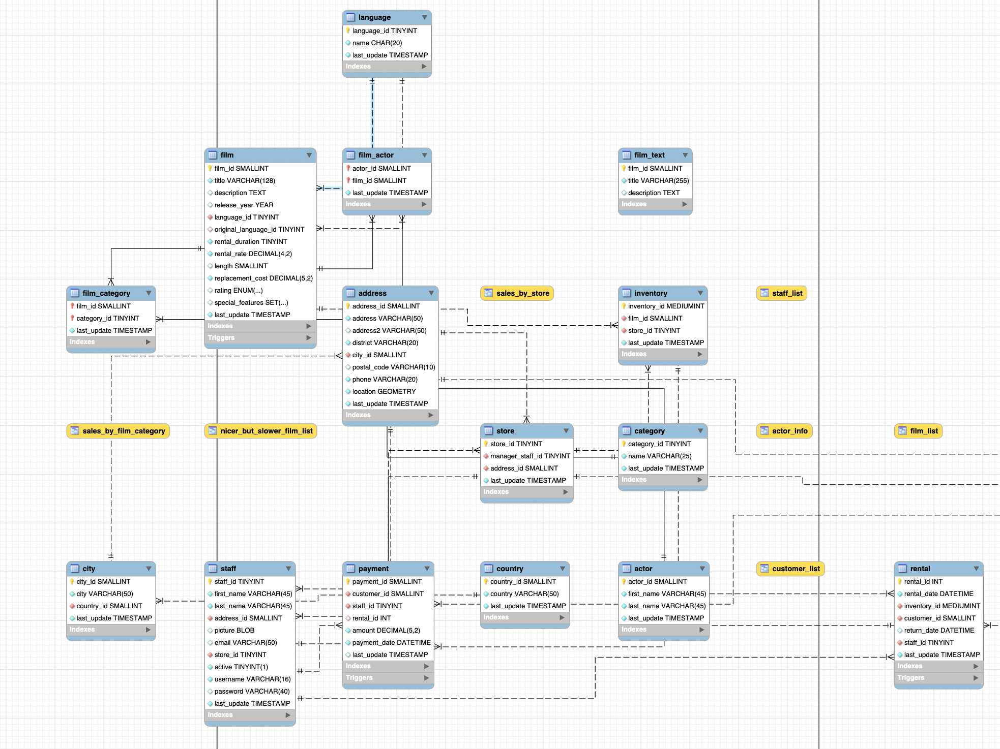

# GoArchive — Archive MySQL Rows Across Single or Multiple Relational Tables, with Parent and Child Rows

[](docs/README_LIMITATIONS.md#environment)
[](docs/README_LIMITATIONS.md#environment)
[](LICENSE)

**GoArchive respects foreign key constraints and ORM relations. Archive, copy, or purge a parent row together with every child row that depends on it — in dependency order, verified before anything is deleted.**

GoArchive is a Go CLI for archiving related MySQL rows across servers. You declare the parent-child relations once in the job config. Foreign keys the schema already declares are checked against that declaration, and relations an ORM enforces only in application code are just as valid. Copy runs parent-first and delete runs child-first, so deleting old `orders` never leaves orphaned `order_items` behind. With verification on, each batch is checked by row count or SHA256 before its source rows are deleted, and an interrupted run resumes from its checkpoint.

## What problem does this solve?

You need to delete or archive old data from a production MySQL database, but those rows have children:

- Deleting old `orders` orphans `order_items`, `order_payments`, and `shipments`
- Deleting old `customers` breaks foreign keys three levels deep
- `ON DELETE CASCADE` silently removes rows you never archived
- Single-table archivers move the parent and leave the children behind
- Deleting in the wrong order fails with MySQL Error 1451 (`Cannot delete or update a parent row`)

GoArchive takes a declared parent-child relation tree, discovers every dependent row by BFS traversal, copies the whole subgraph to an archive server **parent-first**, verifies it arrived intact, then deletes from the source **child-first**.

**Typical uses:** MySQL data retention and GDPR right-to-erasure · shrinking oversized tables to restore query performance · moving cold data to an archive server · purging staging data while preserving referential integrity.

## GoArchive vs pt-archiver

[pt-archiver](https://docs.percona.com/percona-toolkit/pt-archiver.html) is the mature, widely-adopted standard for MySQL archiving. The table below is the comparison — weigh it before choosing.

| | pt-archiver | GoArchive |
|---|---|---|
| Parent-child-aware multi-table archiving | Requires custom orchestration / plugins | ✅ Archives a root and its full child subgraph in dependency order |
| Dependency ordering | manual, via plugin | automatic (Kahn's algorithm) |
| Verify copy before delete | ❌ | ✅ count or SHA256 |
| Inspect INSERT conversion / truncation warnings before source deletion | No built-in check in reviewed [v3.7.1 source](https://github.com/percona/percona-toolkit/blob/v3.7.1/bin/pt-archiver) | ✅ [checked after every application-data INSERT](docs/README_OPERATIONS.md#insert-diagnostics-and-subdivision) |
| Crash recovery / resume | ❌ | ✅ per-root status and a batch checkpoint |
| Foreign key coverage check | ❌ | ✅ blocks uncovered FKs |
| Composite primary keys | ✅ | ❌ |
| Non-integer primary keys | ✅ | Root: ❌; child: ✅ subject to temporal-key restrictions |
| File / CSV output, `LOAD DATA INFILE` | ✅ | ❌ |
| MyISAM sources / MySQL 5.x (EOL) | ✅ | Unsupported; no support planned |
| Batched write mechanisms | `LOAD DATA LOCAL INFILE` / range DELETE | Parameterized multi-row INSERT / chunked `DELETE WHERE pk IN (...)` |
| PXC flow control | ✅ | ❌ |
| Extensibility | ✅ 9 plugin hooks | ❌ |

This comparison covers the reviewed pt-archiver v3.7.1 source linked above. GoArchive's
[verification policy](docs/README_CONFIGURATION.md#verification) defines the narrow
conversion-warning override. pt-archiver starts each invocation from the beginning of its index, so a row that becomes eligible later is still found. GoArchive continues from its checkpoint instead, so its `where` must select cold rows ([the eligibility rule](docs/README_LIMITATIONS.md#no-ddl-and-no-concurrent-writes-during-a-run-contract)).

## Is GoArchive right for your schema?

GoArchive archives **cold** data from **InnoDB** tables joined by **1:1 or 1:N** relationships,
where every participating table has a **single-column primary key**. Preflight rejects anything
outside that envelope before any data moves.

## The Philosophy

Archiving is a custom-coded headache that developers end up building from scratch for every new project. Because every schema is different, "off-the-shelf" tools often fall short—they either ignore your foreign keys entirely or require a massive configuration just to avoid leaving behind a mess of orphaned records.

We got tired of reinventing the wheel and worrying about data integrity every time a table got too big. So we built GoArchive.

While legendary tools like pt-archiver are excellent for offloading single tables, they often fall short in complex ecosystems because they lack an inherent awareness of deep foreign key hierarchies. If you’ve ever looked at the MySQL Sakila sample database, you know that real-world relationships are rarely linear.



GoArchive was born from the need to visualize and automate these complexities. However, to maintain the integrity of your production environment, we adhere to two core principles:

1. **Cold Data Only**
GoArchive is designed ONLY to move COLD data to an archive server—specifically for performance tuning or meeting GDPR compliance.

 > [!IMPORTANT] 
 > If you intend to archive "hot" data that is currently receiving heavy transactions, stop here. Grab a coffee, enjoy the sunshine, and reconsider your architecture. Live-data shifting is outside the scope of this tool.

2. **Zero-Impact Production Archiving**
  In high-traffic production environments, database locks are the enemy. A single record in a master table (e.g., an Order) can represent millions of rows in child tables, so GoArchive moves and purges them in configurable batches, without ever holding a long-term lock on the master table.

---

## ⚠️ Important Disclaimer

> [!WARNING]
> This tool performs data deletion on your source database (`archive`, `purge`). **Rigorously test every archive job in a staging or test environment with representative data before running it against production.**

Testing, backups and the other cautions before production: [Limitations](docs/README_LIMITATIONS.md).

## Documentation

📖 Every document, and where to start: [docs/README.md](docs/README.md).

<a id="whats-included-in-community"></a>

## Features

Complete end-to-end archive, purge, and copy-only workflows in the Community edition:

- **Automatic foreign key dependency resolution** - Kahn's algorithm orders the related tables, so no operation ever orphans a row
- **Referential integrity checks** - Detects foreign keys from outside the archive set pointing into it, including across schemas, and refuses to run rather than let an external `ON DELETE CASCADE` delete uncopied rows
- **Preflight before any data moves** - DELETE triggers, destination INSERT triggers, incompatible destination schemas, composite primary keys and more, all [enumerated in Validation & Preflight](docs/README_VALIDATION.md)
- **Verification before deletion** - Optional row count or SHA256 comparison between source and destination, per batch; a mismatch stops that batch before its delete, and batches already completed stay archived ([SHA256 verification](docs/README_VALIDATION.md#sha256-verification))
- **Crash recovery and resume** - Per-root status and a batch checkpoint persisted in MySQL; an interrupted run resumes where it stopped instead of restarting
- **Batch processing without long locks** - Configurable batch sizes and delays
- **Replication gating** - Holds the job while any monitored replica is lagging, stopped, or unreachable, across a fleet of replicas and all their channels, then resumes the same run once they recover
- **No overlapping runs** - Advisory locks and same-root checks refuse a second run of a job, or of another job on the same root table — except that `copy-only --force` proceeds past a held lock whose heartbeat is stale ([`--force`](docs/README_OPERATIONS.md#--force-only-matters-for-copy-only))
- **Dry-run mode** - Preview the execution plan and filtered row counts; never deletes from the source ([Dry-run payload validation](docs/README_VALIDATION.md#dry-run-payload-validation))
- **Copy-only mode** - Replicate a relational subgraph to another server without ever deleting from source
- **Graceful shutdown** - SIGTERM/SIGINT handling stops cleanly at a batch boundary

## Quick Start

### Installation

From a checkout:

```bash
go build -o goarchive ./cmd/goarchive
```

Release binaries, the published image, Make targets and release builds: [INSTALL.md](INSTALL.md).

### Configuration

Create a configuration file `archiver.yaml`:

```yaml
# Source database (production - data to archive)
source:
  host: localhost
  port: 3306
  user: archiver
  password: change_me
  database: production
  max_connections: 10

# Destination database (archive storage)
destination:
  host: archive.db.internal
  port: 3306
  user: archiver
  password: change_me
  database: archive
  max_connections: 10

# Archive jobs configuration
jobs:
  archive_old_orders:
    root_table: orders
    primary_key: id
    where: "created_at < DATE_SUB(NOW(), INTERVAL 2 YEAR)"
    relations:
      - table: order_items
        primary_key: id
        foreign_key: order_id
        dependency_type: "1-N"

      - table: order_payments
        primary_key: id
        foreign_key: order_id
        dependency_type: "1-N"

      - table: shipments
        primary_key: id
        foreign_key: order_id
        dependency_type: "1-1"
        relations:
          - table: shipment_items
            primary_key: id
            foreign_key: shipment_id
            dependency_type: "1-N"

# Processing settings
processing:
  batch_size: 1000
  batch_delete_size: 500
  sleep_seconds: 1

# Replication gating (optional)
replication:
  enabled: true
  seconds_behind_source_within: 10
  check_interval: 5
  servers:
    - host: replica-db.internal
      user: monitor
      password: change_me
```

`where` is required on every job — use `where: "1=1"` to deliberately process a whole table. A complete annotated example: [configs/archiver.yaml.example](configs/archiver.yaml.example). Every option: [Configuration](docs/README_CONFIGURATION.md).

### Basic Usage

```bash
# Check the plan from yaml:
goarchive plan -c archiver.yaml --job archive_old_orders


=================
  Relation Tree
=================

┌────────────────┐                                                 [ Tree Summary ]
│                │                                                 ----------------
│     orders     ├─────1-N──────┐                                  Root Table:     orders
│                │     │        │                                  Relations:      4 tables
└────────┬───────┘     └────────┼─────1-1───────────────┐          Max Depth:      2 levels
         │                      │                       │          Destination DB: archive
         │                      │                       │
        1-N                     │                       │          [ Processing ]
         │                      │                       │          --------------
         ▼                      ▼                       ▼          Batch Size:      1000
┌────────────────┐     ┌────────────────┐         ┌───────────┐    Batch Delete:    500
│                │     │                │         │           │    Sleep:           1.0s
│  order_items   │     │ order_payments │         │ shipments │
│                │     │                │         │           │    [ Verification ]
└────────────────┘     └────────────────┘         └─────┬─────┘    ----------------
                                                        │          Method:          count
                                                        │
                                                        │
                                                       1-N
                                                        │
┌────────────────┐                                      │
│                │                                      │
│ shipment_items │◄─────────────────────────────────────┘
│                │
└────────────────┘

# … followed by the execution plan; its copy and delete orders for this job:

[Copy Order (parent tables first)]
----------------------------------
  [1] orders (root)
  [2] order_items | FK: order_id -> id
  [3] order_payments | FK: order_id -> id
  [4] shipments | FK: order_id -> id
  [5] shipment_items | FK: shipment_id -> id

[Delete Order (child tables first)]
-----------------------------------
  [1] shipment_items | FK: shipment_id <- id
  [2] shipments | FK: order_id <- id
  [3] order_payments | FK: order_id <- id
  [4] order_items | FK: order_id <- id
  [5] orders (root)

# Validate configuration and run preflight checks
goarchive validate -c archiver.yaml

# Preview what would be archived (dry-run)
goarchive dry-run -c archiver.yaml --job archive_old_orders

# Execute archive (runs preflight, copies to destination, verifies, then deletes)
goarchive archive -c archiver.yaml --job archive_old_orders

# Copy-only (copies to destination, never deletes source)
goarchive copy-only -c archiver.yaml --job archive_old_orders

# Copy-only with --force (see Operations for what it bypasses)
goarchive copy-only -c archiver.yaml --job archive_old_orders --force

# Purge only (deletes without copying - USE WITH CAUTION!)
goarchive purge -c archiver.yaml --job archive_old_orders
```

**Recommended workflow:** `validate` → `dry-run` → `archive`. Every command and flag: [Operations](docs/README_OPERATIONS.md).

## Architecture

```
┌─────────────┐     ┌─────────────┐     ┌─────────────────────┐
│   CLI       │────▶│   Config    │────▶│   Database Manager  │
│  (Cobra)    │     │  (Viper)    │     │   (Connection Pool) │
└─────────────┘     └─────────────┘     └─────────────────────┘
                                                │
                         ┌──────────────────────┼──────────────────────┐
                         ▼                      ▼                      ▼
                   ┌──────────┐          ┌──────────┐          ┌──────────────┐
                   │  Source  │          │  Archive │          │   Replica    │
                   │  (MySQL) │          │  (MySQL) │          │   (MySQL)    │
                   └──────────┘          └──────────┘          └──────────────┘
                         │                      │
                         └──────────────────────┘
                                    │
                         ┌──────────┴──────────┐
                         ▼                     ▼
                ┌─────────────────┐    ┌──────────────┐
                │  Graph Builder  │    │  Replication │
                │ (Kahn's Algo)   │    │     Gate     │
                └─────────────────┘    └──────────────┘
                         │
         ┌───────────────┼───────────────┐
         ▼               ▼               ▼
   ┌──────────┐   ┌──────────┐   ┌──────────┐
   │  Copy    │   │ Verify   │   │  Delete  │
   │  Phase   │──▶│ (Count/  │──▶│  Phase   │
   │          │   │ SHA256)  │   │          │
   └──────────┘   └──────────┘   └──────────┘
```

### Processing pipeline

1. **Preflight** - the checks that apply to the command run before any tracking state is written ([which checks run for which command](docs/README_VALIDATION.md#which-checks-run-for-which-command), including the skip flag)
2. **Graph build** - Kahn's algorithm puts parents before children for the copy; the delete order is its exact reverse (`plan` prints both)
3. **Batch loop** - fetch root IDs → BFS discovery of every child row → copy transaction → verify → delete → checkpoint. `batch_size` is the copy chunk for every table ([Tuning throughput](docs/README_OPERATIONS.md#tuning-throughput); [Resume semantics](docs/README_OPERATIONS.md#resume-semantics))
4. **Safety** - one run per job name and per root table, except `copy-only --force` past a stale held lock ([Concurrency and locking](docs/README_OPERATIONS.md#concurrency-and-locking)); the replication gate holds processing while any monitored replica is lagging, stopped, or unreachable

### Key Components

| Package | Purpose |
|---------|---------|
| `cmd/` | CLI command implementations (Cobra) |
| `internal/config/` | Configuration parsing with Viper |
| `internal/database/` | Database connection pooling and management |
| `internal/graph/` | Dependency graph builder with Kahn's algorithm |
| `internal/archiver/` | Core archive/purge/copy/delete logic |
| `internal/verifier/` | Count and SHA256 verification |
| `internal/replication/` | Replication gate on the library's replica status facts |
| `internal/lock/` | MySQL advisory lock implementation |
| `internal/logger/` | Structured logging with Zap |
| `internal/types/` | Shared row and value types |
| `internal/mermaidascii/` | ASCII diagram rendering for `plan` |

## Requirements

Each command needs specific privileges on the source, the destination and the tracking schema: [Permissions](docs/README_PERMISSIONS.md).

## Testing

How to run every test layer: [tests/README.md](tests/README.md).

## Project Status

- **Edition**: Community
- **Version**: `2.2.3-community` (**stable**)
- **Stable release**: `2.2.3-community` — the current production line.
- **Recommended for**: single-operator workstation archival of cold MySQL data

### Planned for Enterprise

- Archive to BigQuery
- Observability: Prometheus metrics, OpenTelemetry traces, dashboards
- Parallelism: multi-root-PK concurrent processing, pipelining copy/verify/delete
- Admin API for runtime pause / resume / inspect
- Multi-tenancy and horizontal scale
- Adaptive rate limiting
- Web based GUI

## Related tools

- **[pt-archiver](https://docs.percona.com/percona-toolkit/pt-archiver.html)** — the mature
  single-table archiver whose one structural limit GoArchive exists to cover. See
  [the comparison above](#goarchive-vs-pt-archiver).
- **MySQL native partitioning** — if the table is partitioned by date, exchanging a whole
  partition beats any row-by-row tool:

  ```sql
  CREATE TABLE orders_2024 LIKE orders;
  ALTER TABLE orders_2024 REMOVE PARTITIONING;

  -- near-instant metadata swap
  ALTER TABLE orders EXCHANGE PARTITION p2024 WITH TABLE orders_2024;

  -- move orders_2024 to the archive server (mysqldump, or FLUSH TABLES ... FOR EXPORT
  -- plus transportable tablespace), then drop the now-empty partition
  ALTER TABLE orders DROP PARTITION p2024;
  ```

  `DROP PARTITION` on its own destroys the rows rather than archiving them, and
  `EXCHANGE PARTITION` fires no triggers and resets `AUTO_INCREMENT` on the exchanged table.

  It never competes with GoArchive: MySQL forbids foreign keys on partitioned InnoDB tables
  **in both directions**, so a partitioned table has no child subgraph to archive.

## Contributing

1. Fork the repository
2. Create your feature branch (`git checkout -b feature/amazing-feature`)
3. Commit your changes (`git commit -m 'Add amazing feature'`)
4. Push to the branch (`git push origin feature/amazing-feature`)
5. Open a Pull Request

## License

This project is licensed under the MIT License - see the LICENSE file for details.

## Acknowledgments

- [Cobra](https://github.com/spf13/cobra) - CLI framework
- [Viper](https://github.com/spf13/viper) - Configuration management
- [Zap](https://github.com/uber-go/zap) - Structured logging
- [MySQL Driver](https://github.com/go-sql-driver/mysql) - Go MySQL driver
- [mermaid-ascii](https://github.com/AlexanderGrooff/mermaid-ascii) - ASCII diagram generation for table relationship visualization
